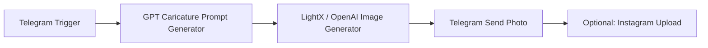

# 🤖 AI Caricature Generator Workflow (n8n)

This project automates the creation of **AI-generated caricatures** based on text or news headlines.  
Built using [n8n](https://n8n.io), it integrates **OpenAI**, **LightX**, and **Telegram/Instagram APIs** to create, stylize, and publish caricature images with captions.

---

## ✨ Features

- 📰 Accepts text or news input (Arabic or English)
- 💬 Uses GPT to summarize & generate creative caricature prompts
- 🎨 Generates humorous AI caricature images (via OpenAI or LightX)
- 📸 Can transform uploaded images into caricatures
- 📲 Automatically posts results to Telegram (and optionally Instagram)
- ☁️ Fully modular — easy to integrate with other AI APIs

---

## 🧠 Original Concept

The initial idea behind this workflow was to **create an AI bot that takes an Arabic news headline** and automatically generates a **political caricature** reflecting the event.

However, due to **policy restrictions** on generating political or potentially sensitive caricatures, most trusted AI models refused to produce such content.  
As a result, the concept evolved into generating **artistic, cartoon-like portraits** inspired by **textual descriptions** in English — for example:

> “Dostoevsky in dark theme and autumn vibes”

In these cases, the AI model interprets the description and generates an **aesthetic or thematic representation** of the historical figure rather than a direct caricature.

You can view an example output in the repository under:  
📁 `AI-Caricature-Workflow/workflow/example output/Dostoevsky in dark theme and automn vibes.jpg`  
alongside other creative samples.

---

## 🧩 Workflow Overview

